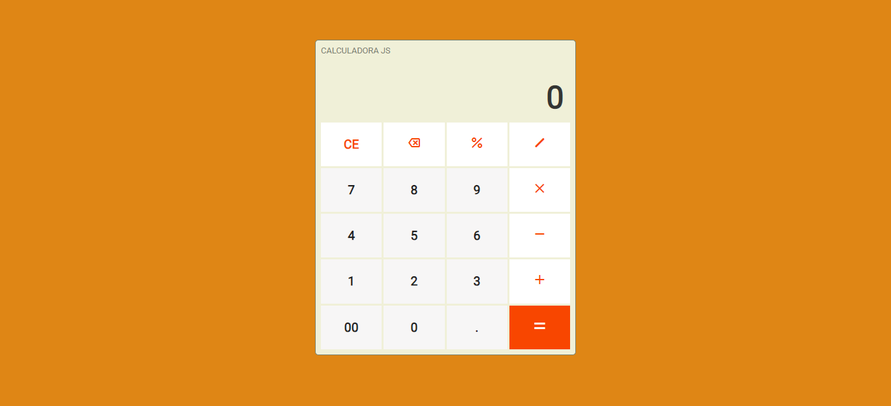

# Calculadora JS

### 💻 Sobre o projeto

- Calculadora JS - é um projeto desenvolvido para praticar o básico das tecnologias HTML, CSS e JAVASCRIPT.

- Como inspiração para o projeto foi utilizado o modelo de funcionalidades de um app de calculadora de celular utilizando suas operações básicas.

### 🎨 Layout

- A baixo o design da aplicação em execução.

  

### 🛠 Tecnologias

- As seguintes ferramentas foram usadas na construção do projeto:

- HTML
- CSS
- JAVASCRIPT

### 📝 Licença

- Fique a vontade para contribuir...

- Feito com ❤️ por Irani Junior 👋🏽